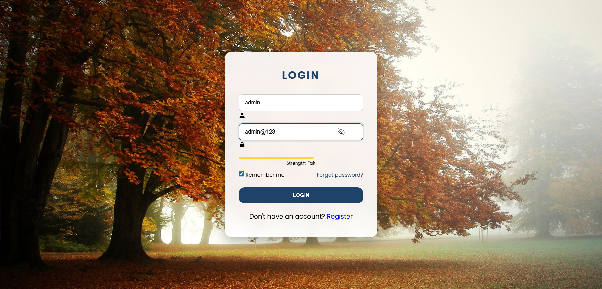

# 🔐 Login Page

A modern full-stack login system built using **HTML, CSS, JavaScript, and Node.js**.
This project features a clean UI with client-side validation and basic backend authentication.

---

## 🚀 Features

* ✨ Responsive and modern login UI
* 🔐 Password strength indicator
* 👁️ Show / Hide password toggle
* 💾 "Remember Me" functionality
* ⚡ Backend authentication
* 🔔 Toast notifications for user feedback

---

## 🛠️ Tech Stack

* **Frontend:** HTML, CSS, JavaScript
* **Backend:** Node.js
* **Other:** Local Storage, Fetch API

---

## 📂 Project Structure

LOGIN_PAGE/
│── index.html
│── style.css
│── script.js
│── server.js
│── screenshot.png
│── README.md

---

## ▶️ How to Run Locally

### 1️⃣ Clone the repository

```bash
git clone https://github.com/Asutosh-Mohanty/LOGIN_PAGE.git
cd LOGIN_PAGE
```

### 2️⃣ Install dependencies

```bash
npm install
```

### 3️⃣ Run the backend server

```bash
node server.js
```

👉 Server runs at: `http://localhost:5000`

---

### 4️⃣ Open frontend

Open `index.html` in your browser.

---

## 🔑 Test Credentials

```plaintext
Username: admin
Password: Admin@123
```

---

## ⚠️ Important Notes

* Backend runs locally and is not deployed
* GitHub does not execute `server.js`
* This project is for learning/demo purposes
* Passwords are stored in plain text (not production secure)

---

## 📸 Screenshot

<p align="center">
  
</p>

---

## 💡 Future Improvements

* 🔐 Implement secure authentication using JWT
* ☁️ Deploy backend on AWS
* 🗄️ Integrate relational database (MySQL / PostgreSQL)
* ☕ Rebuild backend using Java (Spring Boot)
* 🔒 Add password hashing using bcrypt
* 📊 Add user dashboard after login
* 🌍 Deploy full-stack application
* 🏗️ Microservices architecture (Spring Boot)
* ☁️ Use AWS S3 for storage

---

## ⭐ Support

If you like this project, consider giving it a ⭐
